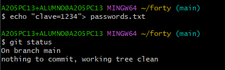

# Trabajo en local- GIT

# Ejercicio 1

Inicializa un nuevo repositorio Git en una carpeta llamada "forty" y agrega los archivos
proporcionados en el aula virtual.

```bash
cd forty
git init
```

# Ejercicio 2

Renombra la rama master a main.

```bash
git branch -M main

```

# Ejercicio 3

Haz que los ficheros README.txt , LICENSE.txt y passwords.txt sean ignorados por el control
de versiones

```bash
$ echo "README.txt" >> .gitignore
echo "LICENSE.txt" >> .gitignore
echo "passwords.txt" >> .gitignore

```

# Ejercicio 4

Crea el archivo passwords.txt . Comprueba que el control de versiones lo ignora

```bash
echo "clave=1234" > passwords.txt
git status

```



# Ejercicio 5

Crea una rama llamada "feature-content" . Muévete a esa rama. Cambia, en la línea 3477, el font-size por 1.5em en el archivo main.css . Confirma cambios y haz commit. Muestra los logs
de la forma más gráfica posible.

```bash
git checkout -b feature-content
git add assets/css/main.css
git commit -m "Cambia font-size a 1.5em en main.css"

```

# Ejercicio 6

Elimina el archivo "passwords.txt" en la carpeta forty . Verifica el estado del repositorio. ¿Hay cambios pendientes?.

No aparece, ya que está ignorado

```bash
rm passwords.txt
git status
```

# Ejercicio 7

Crea un nuevo archivo llamado " about.html ", partiendo del archivo generic.html y agrégalo al
repositorio, haz un nuevo commit.

```bash
cp generic.html about.html
git add about.html
git commit -m "Crea about.html a partir de generic.html"
```

# Ejercicio 8

Cambia a la rama main . Examina los logs del repositorio de forma gráfica.

```bash
git branch -M main
git log --oneline --graph
```


# Ejercicio 9

Modifica algo en el archivo generic.html , comprueba que hay cambios, y realiza otro commit .
Examina los logs del repositorio de forma gráfica.

```bash
git commit -am "Actualiza contenido de generic.html"
git log --oneline --graph
```

# Ejercicio 10

Modifica algo en el fichero elements.html . Confirma los cambios, pero no hagas commit.

```bash
nano elements.html
# (haces cambios)
git add elements.html
git diff elements.html
git restore elements.html
git status   # → limpio otra vez
```

# Ejercicio 11

Mira las diferencias de elements.html . Los cambios no nos gustan, deshaz los cambios de
elements.html . Comprueba que no hay cambios pendientes.

```bash
git diff main feature-content

```

# Ejercicio 12

Muestra las diferencias entre dos ramas.

```bash
git diff main feature-content

```

# Ejercicio 13

Fusiona la rama "feature-content" con la rama principal (main). Muestra los logs del
repositorio de una forma gráfica y completa

```bash
git checkout main
git merge feature-content
git log --oneline --graph --all

```

# Ejercicio 14

Crea una nueva rama llamada " hotfix " y en ella, corrige un error crítico en el archivo
" index.html ". (Por ejemplo, añade el enlace a la nueva página about.html)

```bash
git checkout -b hotfix
# Editar index.html → añadir enlace a about.html
git commit -am "Corrige error crítico y añade enlace a about.html"

```

# Ejercicio 15

Fusiona la rama "hotfix" con la rama principal y verifica el historial de commits de forma que se
vean todas las ramas gráficamente. ¿Borrarías la rama hotfix ? ¿En qué caso? ¿Cómo?

```bash
git checkout main
git merge hotfix
git log --oneline --graph --all
git branch -d hotfix

```

# Ejercicio 16 y 17

Muestra el historial de cambios limitado a los últimos 3 commits.

Etiqueta el commit actual como "v1.0" y muestra las etiquetas existentes.

```bash
git log -3 --oneline
git tag v1.0
git tag

```